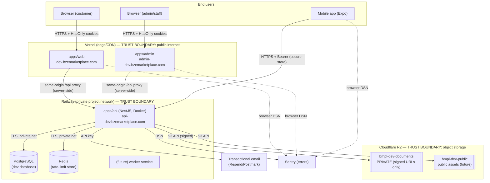

# Development Deployment Architecture (Phase 1.5C target)

> This documents the intended **development cloud** topology. Nothing is deployed
> in Phase 1.5B — this is preparation only.

## Diagram

## Trust boundaries

1. **Public internet → Vercel (web/admin).** TLS everywhere. The browser only
   ever talks to its **own** origin; `/api/*` is proxied server-side to the API,
   so auth cookies stay **first-party** and HttpOnly (never exposed to JS).
2. **Browser/mobile → API.** Two transports, one identity:
   - Web/admin: HttpOnly, Secure, SameSite cookies (access 15 min; refresh 30 d,
     path-scoped to `/api/auth`). CSRF via Origin allow-list + double-submit token.
   - Mobile: `Authorization: Bearer` from `expo-secure-store` (Keychain/Keystore);
     exempt from browser CSRF by design.
3. **API → data stores (Railway private network).** PostgreSQL and Redis are not
   publicly exposed; connections use TLS. The API is the **only** component with
   DB/Redis credentials.
4. **API → Cloudflare R2.** The API holds the R2 credentials. **Browsers/mobile
   never receive R2 credentials.** Private documents are reachable only via
   short-lived signed URLs the API mints **after** authorization + ownership
   checks. The admin app requests a signed URL from the API per view.
5. **API → email / Sentry.** Provider API keys/DSN live only in the API
   environment. Frontend Sentry DSNs are public by design (browser SDKs) and
   scrubbed of PII.

## Domains

| Env | Web | Admin | API |
|---|---|---|---|
| Cloud dev | `dev.bzemarketplace.com` | `admin-dev.bzemarketplace.com` | `api-dev.bzemarketplace.com` |
| Production (future) | `bzemarketplace.com` (+`www`) | `admin.bzemarketplace.com` | `api.bzemarketplace.com` |

## Cookie / CSRF strategy per topology

- **Same-origin proxy (default, recommended):** `COOKIE_DOMAIN` **empty** →
  host-only cookies bound to the web/admin origin; the Next rewrite forwards
  `/api/*` to the API server-side. `SameSite=Strict`. Simplest and most secure.
- **Direct cross-subdomain (alternative):** browser calls `api-dev` directly;
  set `COOKIE_DOMAIN=.bzemarketplace.com` + `COOKIE_SAMESITE=lax` + `COOKIE_SECURE=true`,
  and add the exact web/admin origins to `CORS_ORIGINS`. Never use `*` with credentials.
