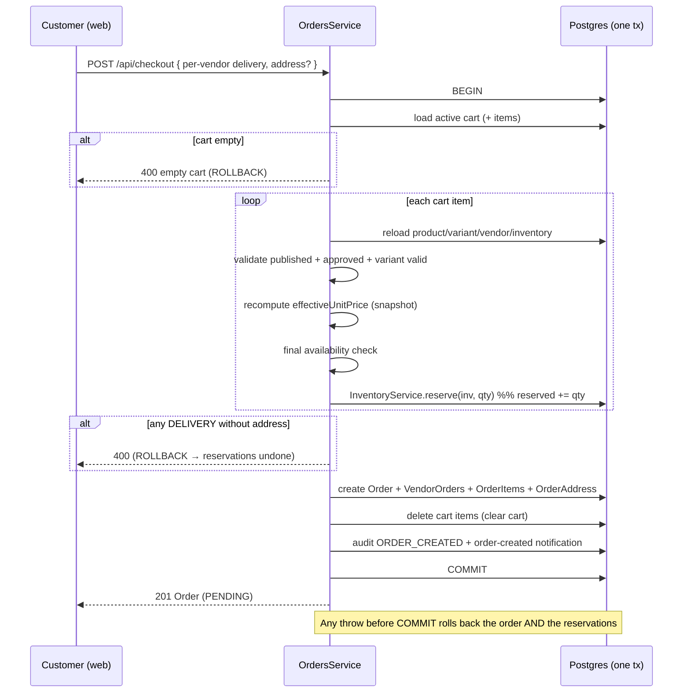
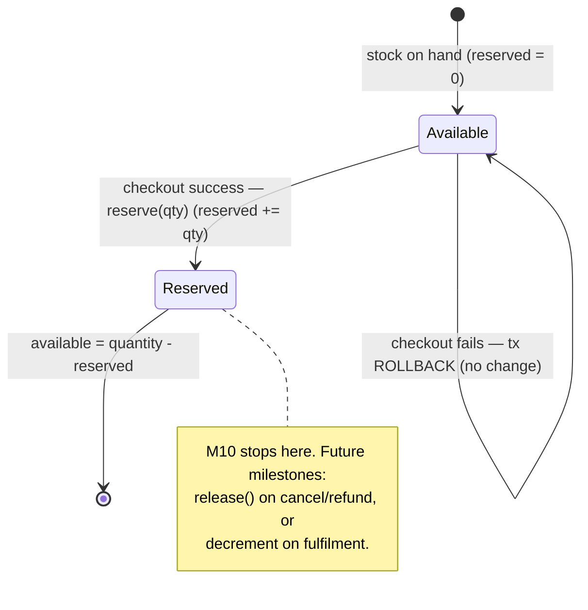
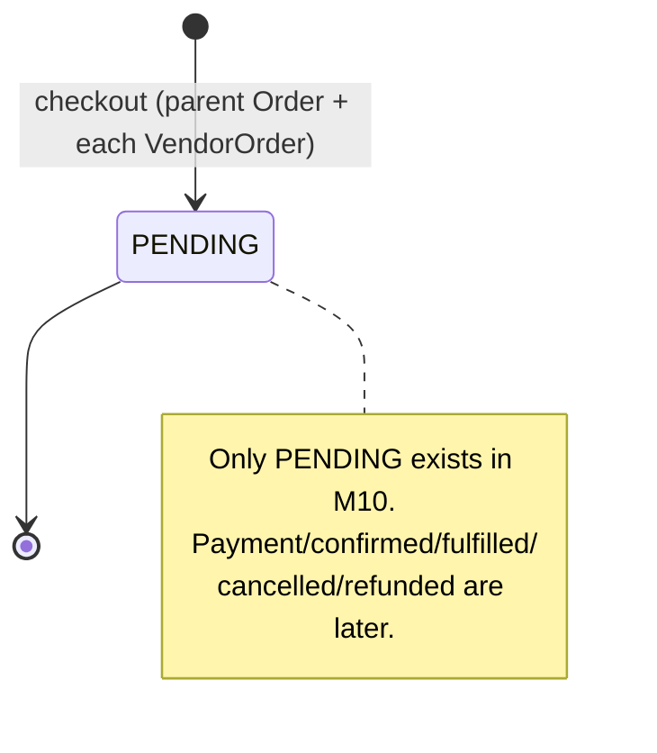

# Phase 3 · M10 — Checkout & Order Creation

Converts a validated cart (M9) into production-ready orders. It stops at order
creation: **no payment capture, wallet debits, shipping dispatch, driver
assignment, refunds, returns, coupons, taxes, invoices, or notifications beyond a
single order-created message.**

Related: [order API](../phase-2/API-INVENTORY.md#orders--checkout-phase-3--m10) ·
[database schema](../phase-2/DATABASE-SCHEMA.md) ·
[architecture](../phase-2/MARKETPLACE-ARCHITECTURE.md) · [OpenAPI](../openapi/marketplace.yaml).

## Architecture decisions
- **Reuse, never duplicate.** Checkout reuses `CartService`'s data, the shared
  `effectiveUnitPrice` pricing rule (extracted to `products/pricing.util.ts` so cart
  and checkout share one rule), `InventoryService.availability()` +
  `reserve()`, `OwnershipService` (vendor scoping), `AuditService`, and the
  existing auth/role/permission guard chain. No second inventory, pricing, or auth
  implementation.
- **Server is the source of truth.** The checkout DTO carries **no prices** — the
  server recomputes each unit price and **snapshots** it onto the `OrderItem`.
- **One atomic transaction.** Validation, inventory reservation, order-graph
  creation, and cart clearing all run inside a single `prisma.$transaction`. Any
  failure rolls back everything, including reservations.
- **Relational, no JSON for line items.** `Order → VendorOrder → OrderItem` with
  real FKs. `VendorOrder.shippingMetadata` is a reserved `Json?` placeholder for
  future tracking (never used for line items).
- **Initial states only.** `Order.status` and `VendorOrder.status` are `PENDING`;
  reservation is represented by `Inventory.reserved`. No payment/fulfilment states.
- **History survives deletion.** `OrderItem.productId/variantId` are `SetNull` and
  the snapshot fields are authoritative; `VendorOrder → VendorProfile` is
  `Restrict` so a storefront with orders can't be hard-deleted.

## Database models
`Order` (parent) — `orderNumber` (unique), `userId`, `status PENDING`, `currency`,
`itemCount`, `subtotalMinor`, `totalMinor` (== subtotal in M10), `placedAt`.
`VendorOrder` — `orderNumber`, `orderId`, `vendorProfileId` (Restrict), `status
PENDING`, `deliveryMethod` (PICKUP|DELIVERY), `customerNotes`, `shippingMetadata`
(placeholder), `itemCount`, `subtotalMinor`. `OrderItem` — snapshot
(`productTitle`, `variantTitle`, `sku`, `unitPriceMinor`, `quantity`,
`subtotalMinor`, `currency`) + nullable `productId`/`variantId` (SetNull).
`OrderAddress` — snapshotted SHIPPING address on the parent order. Migration:
`20260730120000_add_checkout_orders`.

## API
| Method | Path | Who |
|---|---|---|
| POST | `/api/checkout` | customer (self) |
| GET | `/api/orders`, `/api/orders/:id` | customer (self) |
| GET | `/api/vendor/orders`, `/api/vendor/orders/:id` | vendor (own storefront) |
| GET | `/api/admin/orders`, `/api/admin/orders/:id` | admin (`orders.read`, read-only) |

Customers see only their own orders; vendors only their own `VendorOrder`s; admins
have read-only visibility. No editing/fulfilment controls in M10.

## Checkout sequence

## Inventory reservation lifecycle

Reservation only touches `Inventory.reserved` (on-hand `quantity` is unchanged).
Untracked (no inventory row) and `unlimited` items reserve nothing; `allowBackorders`
items reserve even past on-hand (available may go negative — intended).

## Order lifecycle (M10)

## Multi-vendor behavior
A cart spanning N storefronts produces one parent `Order` and N `VendorOrder`s,
each with its own items, subtotal, delivery method, and notes — the seed for
independent per-vendor fulfilment/payout later. The delivery address is captured
once on the parent order when any vendor uses DELIVERY.

## Web & admin
Customer: `/checkout` (per-vendor pickup/delivery + address + disabled "Pay now /
Payment integration coming next"), `/orders/[id]` confirmation + detail, `/orders`
history. Vendor: `/dashboard/orders` list + `/dashboard/orders/[id]` detail (customer
+ delivery address). Admin: read-only `/dashboard/orders` list + detail. Order/
delivery status badges throughout.

## Tests
`apps/api/test/orders.integration.spec.ts` (14): successful checkout, reservation,
price snapshot (survives later price change), multi-vendor split + delivery
address, empty cart, unpublished product, inactive storefront, disabled variant,
insufficient inventory, **transactional rollback** (incl. an earlier item's
reservation rolled back when a later item fails), cart clearing, auth (401), role/
permission (403), and customer/vendor isolation. Full API suite: **164 / 16**, no
regressions.

## Known limitations / risks
- **No payment** — orders are `PENDING`; no charge, wallet debit, or invoice.
- **Reservations never released** in M10 — a cancel/refund/expiry path must call
  `InventoryService.release()` in a later milestone, else reserved stock lingers.
- **No fulfilment/dispatch/tracking/messaging/reviews** — deferred.
- `orders.read` is a new admin permission: production super-admins need a
  permission sync (existing `syncSuperAdminPermissions` via bootstrap) to see the
  admin order views; this does not affect customer/vendor checkout.
- Single currency (BZD); `totalMinor == subtotalMinor` until tax/shipping/fees.

## Recommended M11 scope
Payment authorization + wallet debit against a `PENDING` order (escrow hold via the
existing double-entry wallet), moving `Order`/`VendorOrder` to a `CONFIRMED`/`PAID`
state and recording a payment reference per vendor order — **still no shipping
dispatch or delivery execution.** Add reservation **release** on
cancel/payment-failure to complete the reservation lifecycle.
