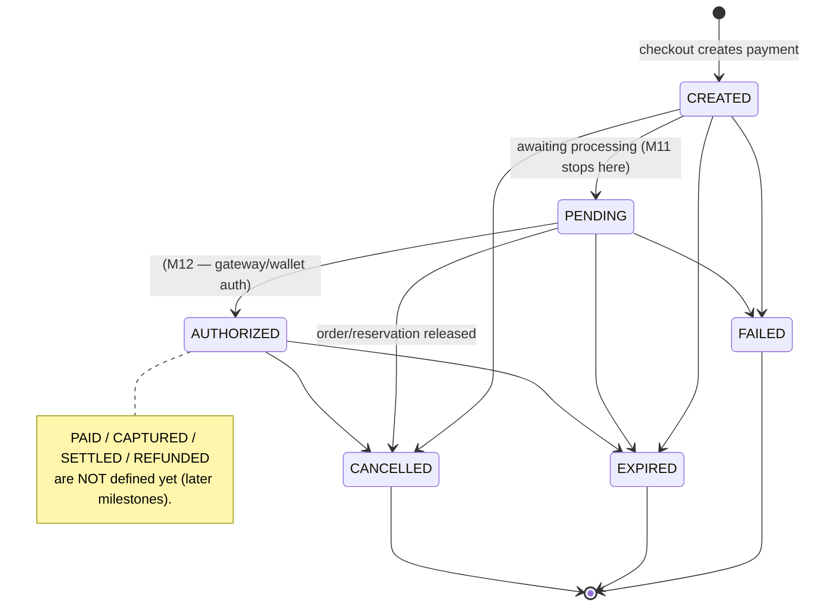
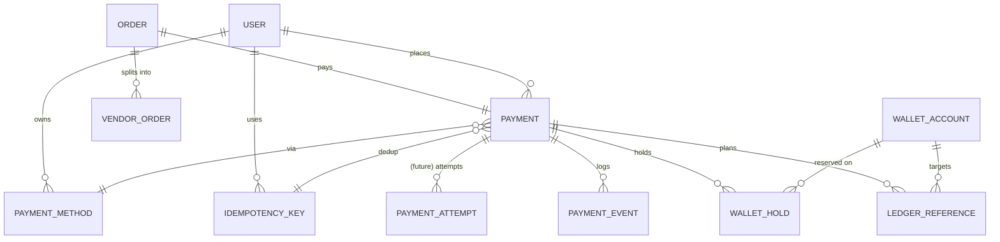

# Phase 3 · M11 — Payment & Wallet Foundation

The complete financial **architecture** for BMPL. It establishes payments, wallet
holds, ledger references, payment events, and idempotency — but **no money moves**:
no wallet ledger entries are written, no balances change, and there is **no
capture, settlement, refund, chargeback, payout, wallet debit, shipping, dispatch,
messaging, or reviews.**

Related: [payment API](../phase-2/API-INVENTORY.md#payments-phase-3--m11--foundation-read-only) ·
[database schema](../phase-2/DATABASE-SCHEMA.md) ·
[architecture](../phase-2/MARKETPLACE-ARCHITECTURE.md) · [OpenAPI](../openapi/marketplace.yaml).

## 1. Architecture decisions
- **Reuse the wallet package; never duplicate it.** The wallet package is pure
  double-entry primitives (`assertBalanced`, `buildTransfer`) gated by
  `assertMoneyMovementEnabled`. M11 links to the existing `WalletAccount` and
  writes **zero** ledger entries — the money-movement gate stays off.
- **Foundation, no behavior beyond creation.** Checkout creates the payment graph
  in the SAME transaction as the order/reservation (all-or-nothing). No gateway,
  no capture. `PaymentAttempt` is a schema-ready table with no rows in M11.
- **Gateway-agnostic.** `PaymentMethodType` = WALLET | CREDIT_CARD | BANK_TRANSFER;
  `PaymentMethod` carries nullable card/bank/gateway fields — a real gateway drops
  in without schema redesign.
- **Idempotent initiation.** A unique `IdempotencyKey(userId, scope, key)` makes a
  duplicate checkout replay the original order/payment (safe under distributed
  retries) instead of creating a second payment.
- **Relational only, normalized.** 7 tables, no JSON for financial records
  (`PaymentEvent.data` / `LedgerReference` refs aside).

## 2. Database models
`Payment` (1‑per‑Order: `paymentNumber`, `amountMinor`, `status`, `methodType`,
`paymentMethodId?`, `idempotencyKeyId?`), `PaymentMethod` (customer instrument;
WALLET provisioned, card/bank nullable), `PaymentAttempt` (gateway attempts —
foundation, unused), `WalletHold` (soft hold → `WalletAccount`; `HELD`/`RELEASED`;
**no ledger entry**), `LedgerReference` (planned movement → `WalletAccount`;
`PENDING`/`POSTED`/`VOID`; `walletTransactionId` filled at capture), `PaymentEvent`
(append-only trail), `IdempotencyKey` (unique per `userId, scope, key`). Migration
`20260730210000_add_payments_wallet_holds`.

## 3. Payment state machine

Only `CREATED→PENDING` (checkout) and `PENDING→CANCELLED` (release) fire in M11.
Transitions are guarded by `canTransitionPayment` (`@bmpl/shared`), each emitting a
`PaymentEvent` + `PAYMENT_STATE_CHANGED` audit row.

## 4. Wallet integration (no money moves)
Reuses `WalletAccount` (the customer's USER/BZD account). A `WalletHold` records
the customer's **intent** to pay `amountMinor` and is `HELD` — it does **not**
create a `WalletLedgerEntry`, does **not** touch `cachedBalanceMinor`, and does
**not** create a `WalletTransaction`. A `LedgerReference` records the *planned*
`DEBIT` (status `PENDING`, unposted). Release marks the hold `RELEASED` and voids
the reference. Tests assert `walletLedgerEntry.count() == 0` and balance unchanged.

## 5. Entity relationships

Payments connect to **VendorOrder**, **wallet ledger** (via `LedgerReference`), and
**audit logs** — and are forward-compatible with future payouts/refunds/disputes
(new tables reference `Payment`/`VendorOrder`, no redesign).

## 6. Idempotency (distributed retries)
`POST /api/checkout` accepts an `Idempotency-Key` header. The key is reserved as
`IdempotencyKey(userId, 'checkout', key)` inside the checkout transaction (unique
constraint). A completed key **replays** the original order/payment; a concurrent
duplicate loses the unique-constraint race (P2002) and is resolved to the same
result — a duplicate **never** creates a second order or payment (test-verified).

## 7. API (read-only foundation)
Customer: `GET /api/payments`, `/api/payments/for-order/:orderId`,
`/api/payments/:id`, `/api/payments/:id/status`. Admin (`payments.read`, read-only):
`GET /api/admin/payments`, `/api/admin/payments/:id`. **No** capture / debit /
settlement endpoints.

## 8. Web & admin
Customer: a payment-status placeholder on the order detail (status + wallet hold +
"Payment processing coming next"), a `/payments` history page, and a `/payments/[id]`
detail (status, hold, activity). **No payment button.** Admin: read-only
`/dashboard/payments` list + detail (holds, events, ledger references).

## 9. Auditing
`PAYMENT_CREATED`, `PAYMENT_STATE_CHANGED`, `WALLET_HOLD_CREATED`,
`WALLET_HOLD_RELEASED`, `IDEMPOTENCY_KEY_REPLAYED` — plus the append-only
`PaymentEvent` trail per payment.

## 10. Tests
`payments.integration.spec.ts` (9): payment + hold + ledger-ref creation, **no
money moved** (0 ledger entries, balance unchanged), audit rows, multi-vendor
relationship, **idempotency** (duplicate key → one payment), hold release + payment
cancel, ownership isolation, and `payments.read` authz. `payment-state.spec.ts` (4,
unit): the transition guard (allowed / illegal / terminal). Full suite: unit
**30/5**, integration **177/17** — no regressions.

## 11. Known limitations / risks
- **No money movement of any kind** (by design) — holds/ledger refs are metadata.
- **No capture/settlement/refund/payout/dispute** — later milestones.
- `PaymentAttempt` is an empty foundation table until a gateway exists.
- One payment per order (parent-level); per-vendor payout allocation is future.
- `payments.read` is a new permission — production super-admins receive it via the
  existing startup permission sync (M10.1).

## 12. Recommended M12 scope
**Wallet capture / authorization** on a `PENDING` payment: turn the `WalletHold`
into a real `ESCROW_HOLD` double-entry `WalletTransaction` (flipping
`assertMoneyMovementEnabled` on for wallet payments), fill the `LedgerReference`
(`walletTransactionId` + `POSTED`), and move the payment `PENDING→AUTHORIZED` — with
a top-up path so a customer can fund their wallet. Still **no** vendor payouts,
capture-to-settlement, shipping, or dispatch.
