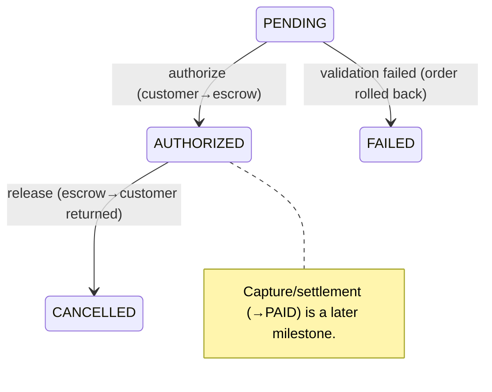

# Phase 3 · M12 — Wallet Authorization & Escrow

BMPL's **first real financial transaction**. Money may move **only** between the
customer's wallet and the escrow account. It does **not** implement vendor payouts,
settlement, refunds, chargebacks, shipping, dispatch, messaging, reviews, or
disputes. Vendor balances remain untouched; escrow owns the funds until a future
settlement milestone.

Related: [wallet/authorize API](../phase-2/API-INVENTORY.md#wallet-authorization--escrow-phase-3--m12--first-real-money-movement) ·
[schema](../phase-2/DATABASE-SCHEMA.md) · [architecture](../phase-2/MARKETPLACE-ARCHITECTURE.md) · [OpenAPI](../openapi/marketplace.yaml).

## 1. Architecture decisions
- **Reuse the wallet package.** Balancing (`assertBalanced`) and the money gate
  (`assertMoneyMovementEnabled`) live in `@bmpl/wallet`. `WalletService`
  (`apps/api/src/wallet`) is the only place that persists transactions.
- **Gate stays off globally; on per-call for escrow.** `WALLET_MONEY_MOVEMENT_ENABLED`
  remains `false`; `postTransaction` is invoked with `enabled=true` **only** for the
  customer↔escrow authorization/release. Nothing else can move money.
- **Convert the M11 hold, don't replace it.** The soft `WalletHold` (`HELD`) becomes
  `AUTHORIZED`, linked to the escrow `WalletTransaction`; the M11 `LedgerReference`
  flips `PENDING→POSTED`.
- **Idempotent by construction.** The escrow transaction `reference` is
  `payment:<id>:auth` (unique) — a duplicate authorize replays instead of
  double-debiting/double-posting.
- **All-or-nothing.** Validation → escrow move → ledger post → payment transition
  run in a single transaction; failure rolls everything back (including the order).

## 2. Financial flow
```mermaid
sequenceDiagram
    participant C as Customer
    participant P as PaymentsService.authorize
    participant W as WalletService
    participant DB as Postgres (one tx)
    C->>P: POST /payments/:id/authorize
    P->>P: validate wallet (exists/active/currency/balance/not-locked/not-suspended)
    alt validation fails
        P->>DB: failAuthorization() — release hold + reservation, cancel order, FAIL payment (ROLLBACK-safe)
        P-->>C: 409 (no money moved)
    else valid
        P->>DB: BEGIN
        P->>W: postTransaction(ESCROW_HOLD): DEBIT customer, CREDIT escrow  (assertBalanced, gate on)
        W->>DB: WalletTransaction + 2 ledger entries; update cached balances
        P->>DB: WalletHold HELD→AUTHORIZED (+ txId); LedgerReference PENDING→POSTED
        P->>DB: Payment PENDING→AUTHORIZED; audit PAYMENT_AUTHORIZED / ESCROW_FUNDS_HELD / WALLET_TRANSACTION_POSTED
        P->>DB: COMMIT
        P-->>C: 201 AUTHORIZED
    end
    Note over P,DB: Inventory reservation is UNCHANGED by authorization.
```

## 3. Escrow implementation
A dedicated `SYSTEM_ESCROW` wallet account (get-or-created per currency, `userId =
null`). Authorization credits escrow and debits the customer; **the vendor
receives nothing**. Escrow **owns** the funds until settlement (a later milestone).
Releasing an authorized order posts the reverse (`ESCROW_RELEASE`: DEBIT escrow,
CREDIT customer), returning the funds — net zero for the customer.

## 4. Ledger implementation (double-entry)
Every `WalletTransaction` is a set of `WalletLedgerEntry` rows that **must net to
zero** (`assertBalanced` throws otherwise). Example authorization:

| Account | Direction | Amount |
|---|---|---|
| Customer wallet | DEBIT | 5000 |
| Escrow wallet | CREDIT | 5000 |
| **Net** | | **0** |

Balances are **derived** from entries (`Σ signed`); `cachedBalanceMinor` is a
maintained cache. The global invariant (Σ of all entries across all accounts = 0)
holds after every operation — asserted by the tests.

## 5. Payment state machine (M12 transitions)


## 6. Wallet validation
`exists` · `active` (status ACTIVE) · `correct currency` · `sufficient balance`
(derived) · `not locked` · `not suspended`. Any failure → `failAuthorization`
(atomic rollback) → `409`.

## 7. Failure handling (atomic)
On validation failure, in one transaction: release the (soft) hold, release the
inventory reservation, cancel the order + vendor orders (`CANCELLED`), void the
`PENDING` ledger references, mark the payment `FAILED`, and audit
(`WALLET_VALIDATION_FAILED`, `PAYMENT_AUTHORIZATION_FAILED`). No partial state; no
money moved (the hold was never authorized).

## 8. API
`POST /api/payments/:id/authorize` (customer), `GET /api/payments/:id/status`,
`GET /api/wallet/transactions/:id` (customer, party-to). Admin read-only
(`wallet.read`): `GET /api/admin/wallet/transactions`, `/api/admin/wallet/accounts`.
No refund/payout/settlement endpoints.

## 9. Web & admin
Customer payment detail shows **Pending Authorization** (+ *Authorize with wallet*),
**Payment Authorized** (+ escrow-hold), **Authorization Failed**, **Insufficient
Funds**, and the escrow-hold badge. Admin `Wallet` page: read-only escrow/system
balances + every transaction with a *net-0* balance indicator.

## 10. Tests
`wallet-authorization.integration.spec.ts` (11): successful authorization (balanced
ledger, escrow movement, AUTHORIZED), reservation unchanged, audit rows,
idempotent replay (no double-debit), insufficient-balance rollback (order
CANCELLED, payment FAILED, no money), currency-mismatch / locked / suspended
rejections, multi-vendor (vendor balances stay 0), escrow **release round-trip**
(funds returned, net 0), and authz/ownership + admin wallet reads. Every test
asserts the **global ledger nets to 0**. `payment-state.spec.ts` (unit) covers the
transition guard. Full suite: unit **30/5**, integration **188/18** — no regressions.

## 11. Known limitations / risks
- **Escrow is the terminus in M12** — no settlement/payout/refund yet, so escrow
  accumulates authorized funds until those milestones.
- **No wallet top-up / funding** in M12 (money moves only customer↔escrow) — a
  customer needs a pre-existing balance to authorize (a `$0` wallet is correctly
  rejected). Funding is recommended for M13.
- Single payment per order; single currency (BZD) in practice.

## 12. Recommended M13 scope
**Wallet top-up (funding):** let a customer add funds to their wallet
(external/clearing → customer wallet) via a balanced double-entry transaction, so
authorization has a real balance to draw on. Keep it strictly separate from
settlement/payouts. This unblocks live successful-authorization verification in
production. (Settlement — escrow → vendor payout — remains a later milestone.)
